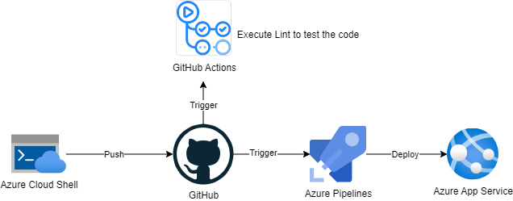
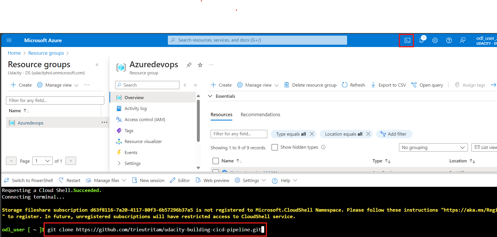
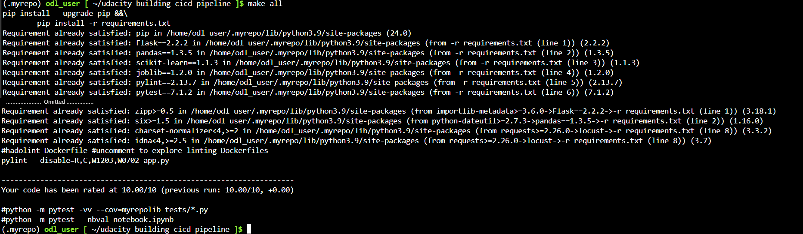
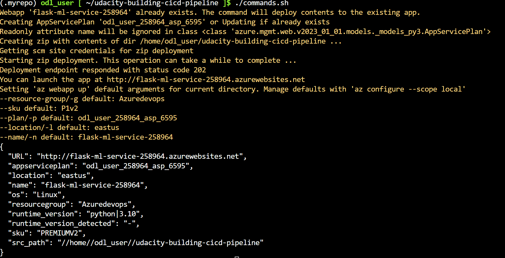
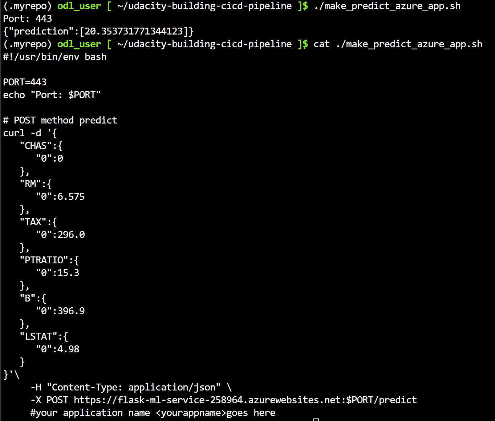
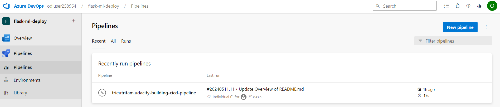
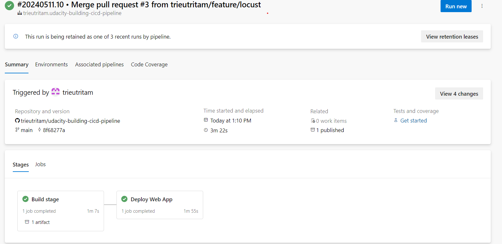
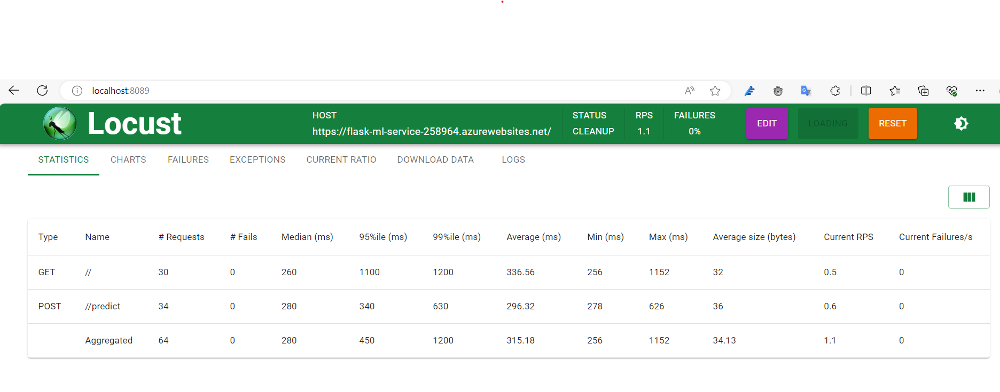
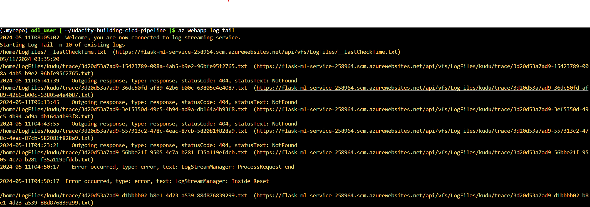

[](https://dev.azure.com/udacitydevops/flask-ml-deploy/_build/latest?definitionId=2&branchName=main)
# Overview

In this project, you will build a Github repository from scratch and create a scaffolding that will assist you in performing both Continuous Integration and Continuous Delivery. You'll use Github Actions along with a Makefile, requirements.txt and application code to perform an initial lint, test, and install cycle. Next, you'll integrate this project with Azure Pipelines to enable Continuous Delivery to Azure App Service.

This repository contains project resources that I've created and the [submissions](./submissions) folder contains:

- `project_plan`: Contains Project Plan Excel file.
- `screenshots`: Contains required screenshot files.

## Project Plan

It is critical to have an effective project plan and task tracking.

- [Trello board](https://trello.com/invite/b/YeApRI37/ATTI6ffb96be66f208bc10c63ce4ee9da271F5EF2726/building-a-ci-cd-pipeline) for task tracking
- [An Excel spreadsheet](./submissions/project_plan/Project%20Management.xlsx) that includes the original and final project plan>

## Instructions



### Test project locally using Azure Cloud Shell

1. Download project code into Azure Cloud Shell
   Go to Azure Portal and open Azure Cloud Shell then clone this repository
   
2. Create and Activate Python virtual environment

```bash
$ python -m venv ~/.myenv
$ source ~/.myenv/bin/activate
```

3. Install and execute test locally (Make sure you have `make` command installed)

```bash
$ make all
```

Result:


### Deploy the project to Azure Web App

```bash
$ az webapp up -g Azuredevops -n <Your global unique web app name>
```

After execute above command the app will be deployed and result is displayed as following example:


Execute test against deployed application
Edit the host in file `./make_predict_azure_app.sh` to your application URL after successfully deployed. Then execute below command to test.

```bash
$ ./make_predict_azure_app.sh
```

Result:


### Setup Azure Pipelines

Please follow this [instructions](https://learn.microsoft.com/en-us/azure/devops/pipelines/ecosystems/python-webapp?view=azure-devops&tabs=linux) to set up Azure Pipeline for the project. In general, the following steps need to be done:

1. Go to dev.azure.com and create an Azure Devops project.
2. Create a service connection to your Azure resources.
3. Create a pipeline with existing [azure-pipeline.yaml](./azure-pipelines.yml) file and change following variables:

   - `azureServiceConnectionId`: '[YOUR SERVICE CONNECTION ID]'
   - `webAppName`: '[YOUR DEPLOYED AZURE WEB APP NAME]'
   - `environmentName`: '[ENV NAME THAT YOU WANT]'
   - Change the Azure Pipeline agent pool name of `pool: myAgentPool`

The pipeline will be looked like this:

Exammple of the run detail:


Successfull prediction after pipeline deploy the app:


### Load test using locust

```bash
$ locust -H <YOUR WEB APP URL>
```

Example:

```
$ locust -H https://flask-ml-service-258964.azurewebsites.net/
```



### Stream of the Log file

```
$ az webapp log tail
```



## Enhancements

This pipeline can be enhanced as following:

- Deploy to multiple deployment slot for Dev, Test, Prod.
- Integrate with GitHub Action for CD.

## Demo

[Here is the demo video](https://youtu.be/y07NHDvOZ6A)
